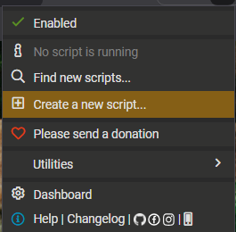

# Spool - ChatGPT Exporter

Userscript to export ChatGPT conversations.

## Installation

1. Install [TamperMonkey](https://tampermonkey.net) browser extension

2. Create new script 



paste content from `spool.user.js`
## Usage

1. Go to chatgpt.com
2. Click 📦 button (bottom right)
3. Select conversations
4. Export

## Features

- Individual conversation selection
- Preview before exporting
- Search by title
- Export as JSON + Markdown + ZIP

## Output format

```
chatgpt-export.zip
├── json/
├── markdown/
└── files/
```

## License

MIT

## Development

### Project Structure

```
spool/
├── src/
│   ├── config.js      # Constants
│   ├── state.js      # State management
│   ├── api.js        # API fetch
│   ├── parser.js     # Parsers
│   ├── export.js     # ZIP export
│   ├── ui.js        # UI + styles
│   └── main.js      # Entry point
├── scripts/
│   ├── build.js     # Build script
│   └── metadata.txt # UserScript metadata
└── spool.user.js   # Generated (do not edit)
```

### Build

```bash
cd scripts
node build.js
```

### Contributing

1. Edit files in `src/`
2. Run `node scripts/build.js`
3. Test in TamperMonkey
4. Commit and push
